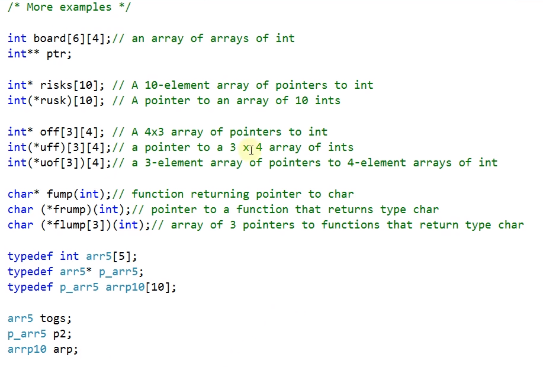

# 14.24 복잡한 선언을 해석하는 요령
## 복잡하게 생각할 만한 것들, 원칙

            *	indicates a pointer
            ()	indicates a function: 매개변수가 들어가는 공간
            []	indicates an array
* 원칙, 조언: Deciphering Complex Declarations (KNK 18.4)
    - Always read declarations from the inside out. (안 쪽에서부터)
    - When there's a choice, always favor [] and () over *(asterisk) (우선순위)

## 예시들

* `int* ap[10];`
    - 우선순위: `[]`, => `int*` 10개짜리 배열
    - typedef: `typedef int* pint;`
        - `pint ap2[10];`: `int* ap2[10]`와 동일.

* `float* fp(float);`도 마찬가지.
    - 함수
    - 인식자(fp)를 찾고, 왼쪽 *, 오른쪽 ()
    - typedef: `typedef float* pfloat;`
    - `pfloat fp2(float)` : `float* fp2(float)`

* `void (*pf)(int)`
	- 1. `(*pf)`, pointer to
    - 2. `(int)`, function with int argument
    - 3. `void`, returning void

* `int* (*x[10])(void)`
    - 1. `x[10]`, array of
    - 2. `*x[10]`, pointers to
    - 3. `(void)`, functions with no arguments
    - 4. `int*`, returning pointer to int
        - __int에 대한 포인터를 반환해주나 매개변수는 없는 함수__ 에 대한 포인터의 배열

## 안 되는 예시

1. 함수가 배열을 반환할 수는 없다.
    - `int f(int)[] // wrong`
* 배열에 대한 포인터를 반환할 수는 있다.
    - `int(*f(int))[];`
2. 함수는 함수를 반환할 수 없다.
    - `int g(int)(int); // wrong`
* 함수에 대한 포인터를 반환할 수는 있다.
    - `int (*g(int))(int);`
3. 함수의 배열은 불가능하다.
    - `int a[10](int); // wrong`
* 함수 포인터의 배열은 가능하다.
    - `int (*x2[10])(int);`

## typedef 이용하기
            typedef int FCN(int);
            typedef FCN* FCN_PTR;
            typedef FCN_PTR FCN_PTR_ARRAY[10];
            FCN_PTR_ARRAY x3;
* `FCN_PTR_ARRAY x3`와 `int (*x2[10])(int)` 모두 `int`가 들어오고 `int`가 나가는 함수에 대한 포인터를 10개 배열로 저장할 수 있는 자료형.

## 그외 예제들
