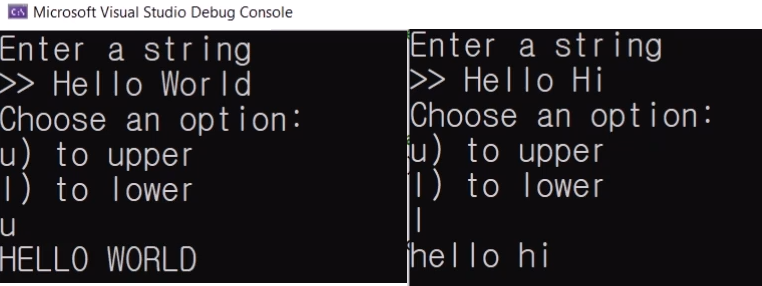

# 14.26 함수 포인터의 배열 연습문제

 ## prof.
            #define _CRT_SECURE_NO_WARNINGS
            #include <stdio.h>
            #include <ctype.h>
            #include <stdlib.h>
            #include <stdbool.h>

            void update_string(char* str, int(*pf)(int));
            void ToUpper(char* str);
            void ToLower(char* str);
            void Transpose(char* str); // TODO: add a new menu

            int main()
            {
                char options[] = { 'u', 'l', 't' }; // TODO: add a new menu
                int n = sizeof(options) / sizeof(char);

                typedef void (*FUNC_TYPE)(char*);
                FUNC_TYPE operations[] = { ToUpper, ToLower, Transpose }; // TODO: ad a new menu;

                printf("Enter a string\n>> ");

                char input[100];
                
                while (scanf("%[^\n]%8*c", input) != 1)
                    printf("Please try again. \n>> ");

                while (true)
                {
                    printf("Choose an option:\n");
                    printf("u) to upper\n");
                    printf("l) to lower\n");
                    printf("\t) to transpose\n"); // TODO: add a new menu

                    char c;
                    while (scanf("%c%*[^\n]%*c", &c) != 1)
                        printf("Please try again. \n");

                    bool found = false;

                    /*switch (c)
                    {
                    case 'u':
                        ToUpper(input);
                        found = true;
                        break;
                    case 'l':
                        ToLower(input);
                        found = true;
                        break;
                    }*/

                    for (int i = 0; i < n; ++i)
                        if (options[i] == c) {
                            (*(operations[i]))(input);
                            found = true;
                            break;
                        }

                    if (found)
                        break;
                    else
                        printf("Wrong input, try again\n");
                }
                
                printf("%s\n", input);
                
                return 0;
            }

            void update_string(char* str, int(*pf)(int))
            {
                while (*str)
                {
                    *str = (*pf)(*str);
                    str++;
                }
            }

            void ToUpper(char* str)
            {
                update_string(str, toupper);
            }

            void ToLower(char* str)
            {
                update_string(str, tolower);
            }

            void Transpose(char* str)
            {
                while (*str)
                {
                    if (islower(*str))
                        *str = toupper(*str);
                    else if (isupper(*str))
                        *str = tolower(*str);
                    str++;
                }
            }