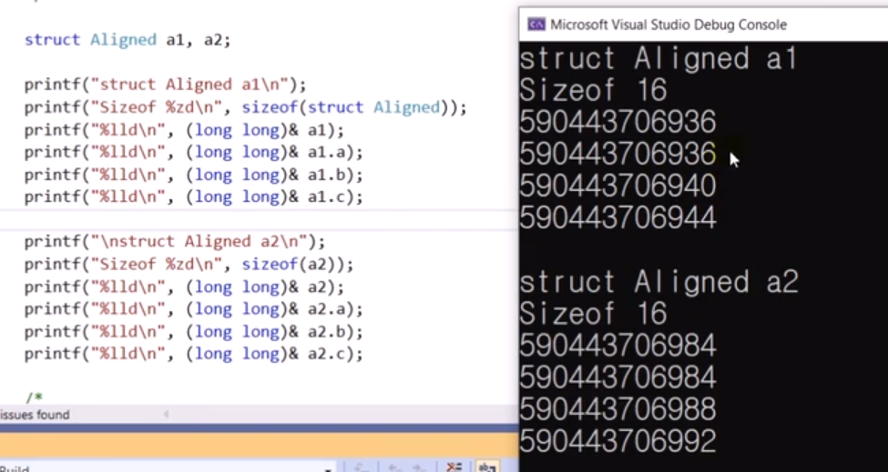
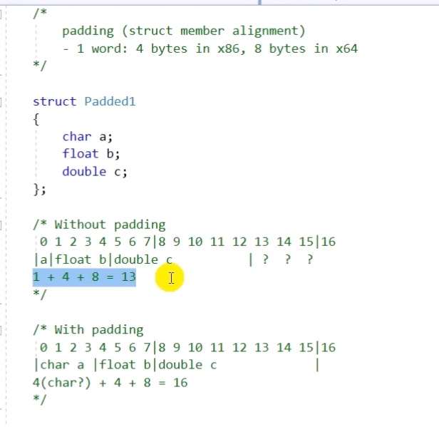
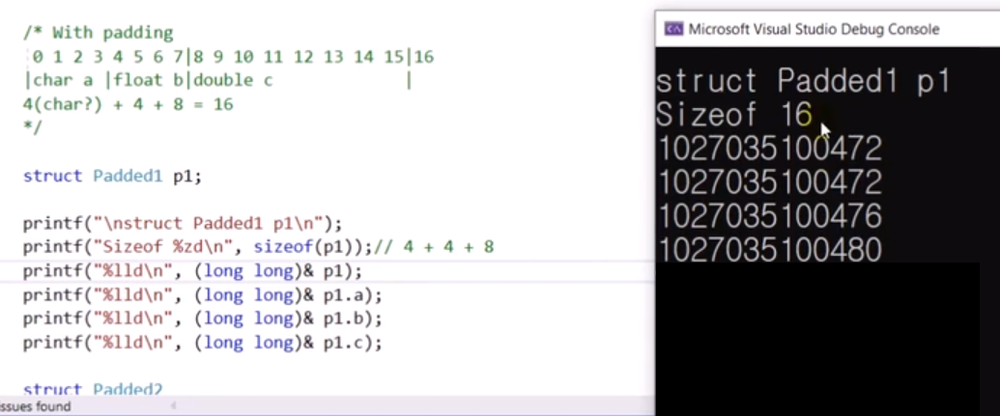
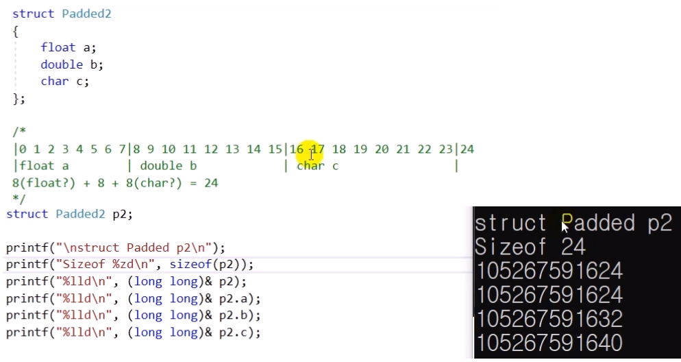
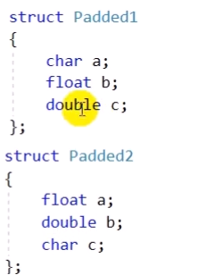
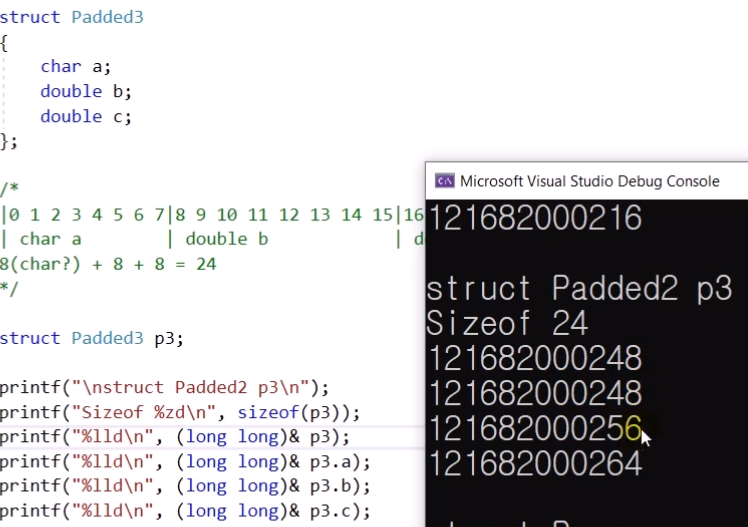
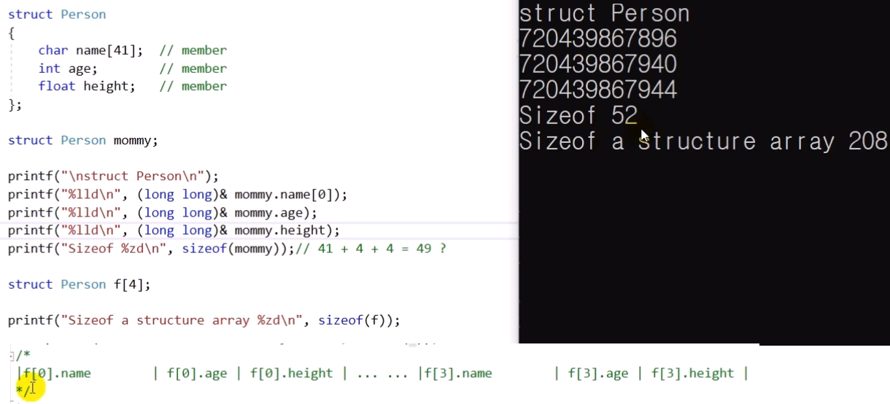
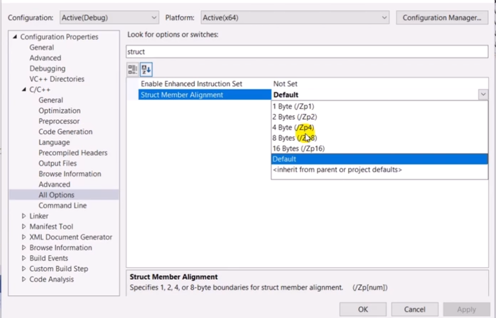
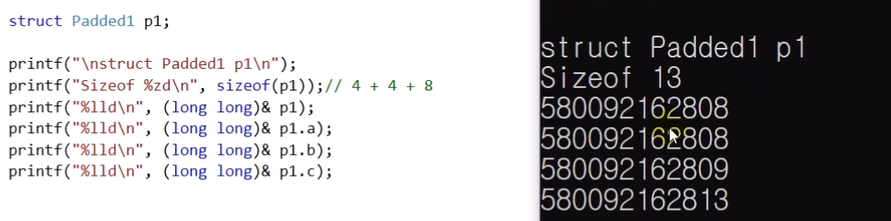

# 14.3 구조체의 메모리 할당
* 특징: 배열과 달리 다른 멤버들이 나열되어 있는 형태 => 효율성을 높이기 위해 '메모리 패딩' 서용

## 예시
            struct Aligned
            {
                int a;
                float b;
                double c;
            }

            0 1 2 3 4 5 6 7| 8 9 10 11 12 13 14 15|
            |int a |float b| double c             |

            struct Aligned a1, a2;

### 메모리 사이즈

* 멤버 간 주소: 4씩 차이
* 동일한 2개의 패턴

### 메모리 패딩

* 13이 나와야 할 듯하나, 16이 출력
    - 남는 뒷 공간을 채움.
* `p1`과 `p1.a`의 주소 동일.
    - 구조체 첫 번쨰 멤버의 주소, 구조체 변수 자체의 주소 동일

#### 패딩
* padding: struct member alignment
- 1 word: 4 bytes in x86, 8 bytes in x64
    - 데이터를 묶어서 보내는 것이 효율적.
    - word: 메모리와 cpu가 데이터를 주고 받을 때 최소 얼만큼의 용량을 주고 받는지를 지칭하는 단어.

#### 원리

            0 1 2 3 4 5 6 7 |8 9 10 11 12 13 14 15 16
            a|float b|double c           | ? ? ?

* 8바이트 씩 보낸다고 가정해보자
    - 만약 패딩x?
    - 꽉꽉 채워야 하니 쭉쭉 넣음.
    - 그러나 c의 일부 잘리게 되어 어쨌든 한번에 보낼 수 없음.
    - 어차피 빈공간이 뒤에 생김. 그럴 바엔 앞에 추가해주어 줄을 맞추자. 효율 ↑

            0 1 2 3 4 5 6 7|8 9 10 11 12 13 14 15| 16
            |char a|float b| double c            |

### 패딩 예시

* 컴파일러가 더블을 자르기 않기 위해 float와 char에 padding을 넣음.

* 두 구조체는 정보의 양은 같은데 차지하는 정도에 차이가 있음. (padding)

* 위와 비슷한 사례

### 배열: 패딩 가능성

* 구조체의 배열도 확인
    - 메모리 사용 순서

### 패딩은 컴파일러가 만드는 것
* 설정

* alignment: 패딩 - 1
    - 거의 끈 것과 유사
* 예시
