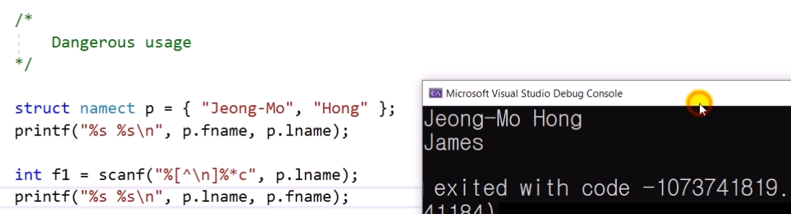
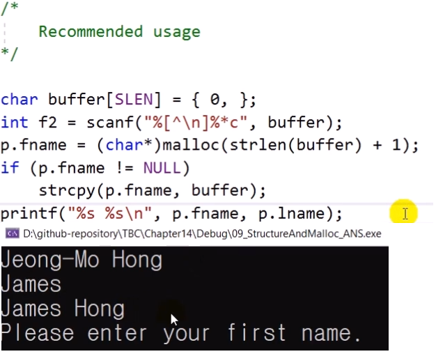
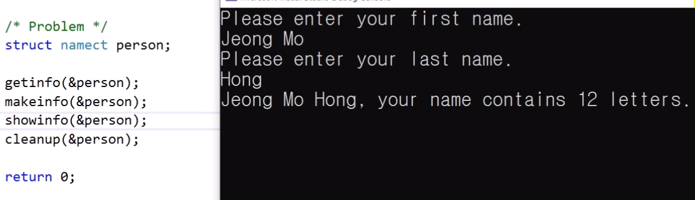

# 14.9 구조체와 할당 메모리
* 구조체의 멤버로서 할당 메모리를 사용할 수 있도록 할당 메모리를 가리키는 포인터를 구조체의 멤버로 사용하기.

## 예시

### dangerous usage

* 비정상 종료
    - 저장된 메모리 공간을 건들면 안 되는데 scanf로 건들이려 시도했기 때문.

### Recommend usage

* 동적 할당을 이용함.

## 실습

            #define _CRT_SECURE_NO_WARNINGS
            #include <stdio.h>
            #include <string.h> // strlen(), strcmp()
            #include <stdlib.h> // malloc(), free()
            #define SLEN 81

            struct namect {
                char* fname;
                char* lname;
                int letters;
            };

            void getinfo(struct namect*);			// allocate memory
            void makeinfo(struct namect*);
            void showinfo(const struct namect*);
            void cleanup(struct namect*);			// free memory when done
            char* s_gets(char* st, int n);

            int main()
            {
                /*
                    Dangerous usage
                */

                //struct namect p = { "Jeong-Mo", "Hong" }; // constant 형태로 되어 있는 문자열: 
                //										  // program과 함께 text segment에 저장
                //										  // text segment: read only, 값 바꾸긴x
                //printf("%s %s\n", p.fname, p.lname);

                //int f1 = scanf("%[^\n]%*c", p.lname);   // *은 무시. 글자 하나.\n 무시
                //printf("%s %s", p.lname, p.fname);

                /*
                    Recommend usage
                */
                
                /*char buffer[SLEN] = { 0, };
                int f2 = scanf("%[^\n]%*c", buffer);
                p.fname = (char*)malloc(strlen(buffer) + 1);
                if (p.fname != NULL)
                    strcpy(p.fname, buffer);
                printf("%s %s\n", p.fname, p.lname);*/

                struct namect person;

                getinfo(&person);
                makeinfo(&person);
                showinfo(&person);
                cleanup(&person);

                return 0;
            }

            void getinfo(struct namect* pst)
            {
                int flag;
                char temp[SLEN] = { 0, };

                printf("Please enter your first name. \n");
                // s_gets(pst->fname, NLEN);
                flag = scanf("%[^\n]%*c", temp); // 다른 리턴값을 받으면?
                if (flag != 1)
                    printf("Wrong input"); // TODO: receive input again
                else
                {
                    pst->fname = (char*)malloc(strlen(temp) + 1); // +1 is for '\0'
                    if (pst->fname != NULL)
                        strcpy(pst->fname, temp); // 동적할당 받은 값을 복사
                    else
                        printf("Malloc() failed");
                }

                printf("Please enter your last name. \n");
                // s_gets(pst->lname, NLEN);
                flag = scanf("%[^\n]%*c", temp); // 다른 리턴값을 받으면?
                if (flag != 1)
                    printf("Wrong input"); // TODO: receive input again
                else
                {
                    pst->lname = (char*)malloc(strlen(temp) + 1); // +1 is for '\0'
                    if (pst->lname != NULL)
                        strcpy(pst->lname, temp); // 동적할당 받은 값을 복사
                    else
                        printf("Malloc() failed");
                }

            };

            void makeinfo(struct namect* pst)
            {
                pst->letters = strlen(pst->fname) + strlen(pst->lname);
            };

            void showinfo(const struct namect* pst) 
            {
                printf("%s %s, your name contains %d letters. \n",
                    pst->fname, pst->lname, pst->letters);
            };

            void cleanup(struct namect* pst)
            {
                free(pst->fname);
                free(pst->lname);
            };

            char* s_gets(char* st, int n)
            {
                char* ret_val;
                char* find;

                ret_val = fgets(st, n, stdin); // vs. scanf()
                if (ret_val)
                {
                    find = strchr(st, '\n');	// look for newline
                    if (find)					// if the address is not null
                        *find = '\0';			// place a null character there
                    else
                        while (getchar() != '\n')
                            continue;			// dispose of rest of line
                }

            };