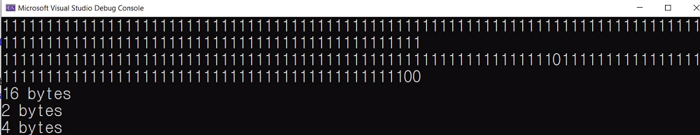
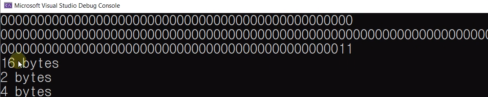
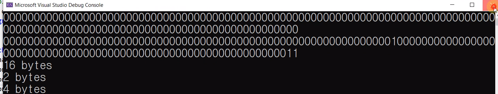

# 15.11 비트필드의 패딩

## 예제
### 선언
            #define _CRT_SECURE_NO_WARNINGS
            #include <stdio.h>
            #include <limits.h>
            #include <stdbool.h>
            #include <string.h>

### 크기

            struct {
                bool option1 : 7;
                bool option2 : 1;
            }bbf;

            struct {
                unsigned short option1 : 8;
                unsigned short option2 : 7;
                unsigned short option3 : 1;
            } usbf;

            struct {
                unsigned int option1 : 1; 
                unsigned int option2 : 1;
            } uibf;

* printf
            printf("%zu bytes \n", sizeof(bbf)); // 1 
            printf("%zu bytes \n", sizeof(usbf)); // 2 bytes
            printf("%zu bytes\n", sizeof(uibf)); // 2인데 4 bytes

* 비트필드의 크기
    - `unsigned int option1 : 1`로 선언되어 크기가 1비트지만, 비트필드의 크기를 계산할 때 작용.

### 크기를 변경하면

            struct {
                unsigned short option1 : 1;
                unsigned short option2 : 1;
                unsigned short option3 : 1;
            } usbf;

            printf("%zu bytes \n", sizeof(usbf)); // 2 bytes

* short가 2바이트기 때문에 2 bytes
* 자료형에 따라감을 알 수 있음.

            struct {
                    bool option1 : 1;
                    bool option2 : 1;
                    unsigned long long option3 : 1;
                    }bbf;
            printf("%zu bytes \n", sizeof(bbf)); // 16 bytes

* 16 바이트
    - 메모리 패딩
    

### 확인해보기
#### Case 1
* `memset`으로 `bbf`에 해당하는 메모리를 sizeof(bbf)만큼 1로 초기화

            struct {
                bool option1 : 1;
                // bool		 : 0;
                bool option2 : 1;
                unsigned long long option3 : 1;
            }bbf;

            memset((char*)&bbf, 0xff, sizeof(bbf));
            print_binary((char*)& bbf, sizeof(bbf));
            bbf.option1 = 0;
            bbf.option2 = 0;
            bbf.option3 = 0;
            print_binary((char*)&bbf, sizeof(bbf));

* 출력

* 16바이트 => 16 * 8 만큼의 1이 나열되어 있음.

#### Case 2
            memset((char*)&bbf, 0xff, sizeof(bbf));
            print_binary((char*)& bbf, sizeof(bbf));
            bbf.option1 = 1;
            bbf.option2 = 1;
            bbf.option3 = 2;
            print_binary((char*)&bbf, sizeof(bbf));

#### Case 3

	memset((char*)&bbf, 0xff, sizeof(bbf));
	print_binary((char*)& bbf, sizeof(bbf));
	bbf.option1 = 1;
	bbf.option2 = 1;
	bbf.option3 = 1;
	print_binary((char*)&bbf, sizeof(bbf));

* 패딩이 생겨난 곳 확인 가능

## 강제 메모리 패딩

        struct {
            bool option1 : 1;
            bool option2 : 1;
            bool        : 0;
            unsigned long long option3 : 1;
        }bbf;

        struct {
            unsigned short option1 : 8;
            unsigned short option2 : 7;
            unsigned short : 0;
            unsigned short option3 : 1;
        } usbf;

        struct {
            unsigned int option1 : 1; // 크기는 1 비트지만 unsigned int(어떤 자료형)으로 해석해라.
            unsigned int : 0;
            unsigned int option2 : 1; // 
        } uibf;

        printf("%zu bytes \n", sizeof(bbf)); // 2 bytes
        printf("%zu bytes \n", sizeof(usbf)); // 4 bytes
        printf("%zu bytes\n", sizeof(uibf)); // 8 bytes

* padding을 더 받더라도 크기가 가장 큰 자료형만큼 강제로 메모리를 배당 받을 수 있음. 