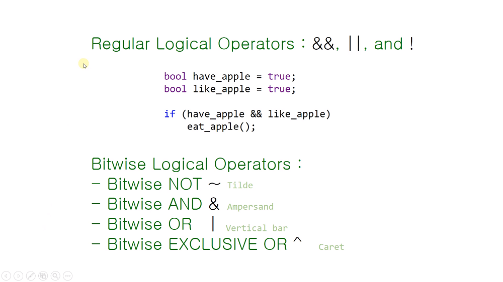
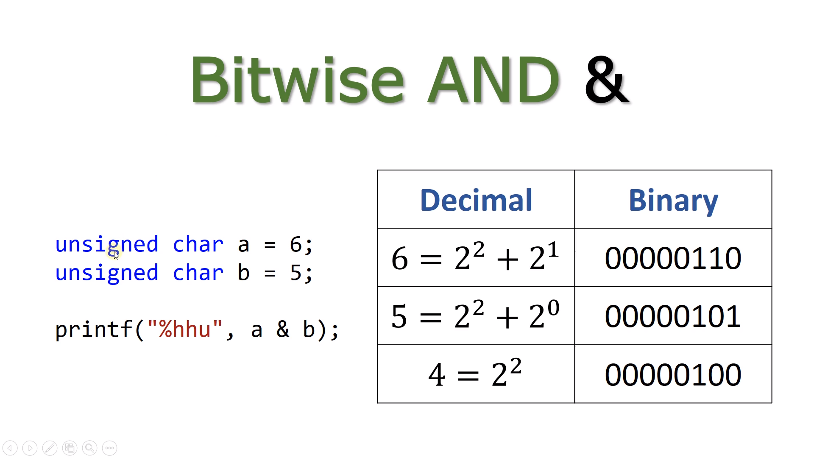
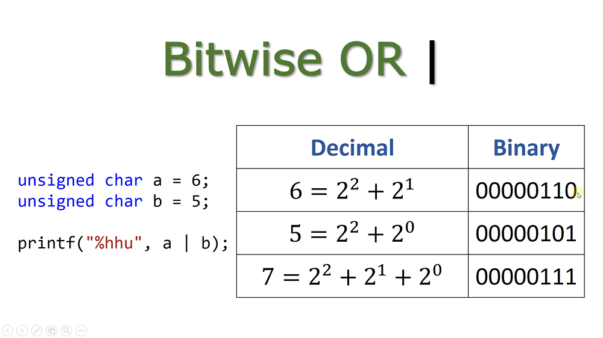
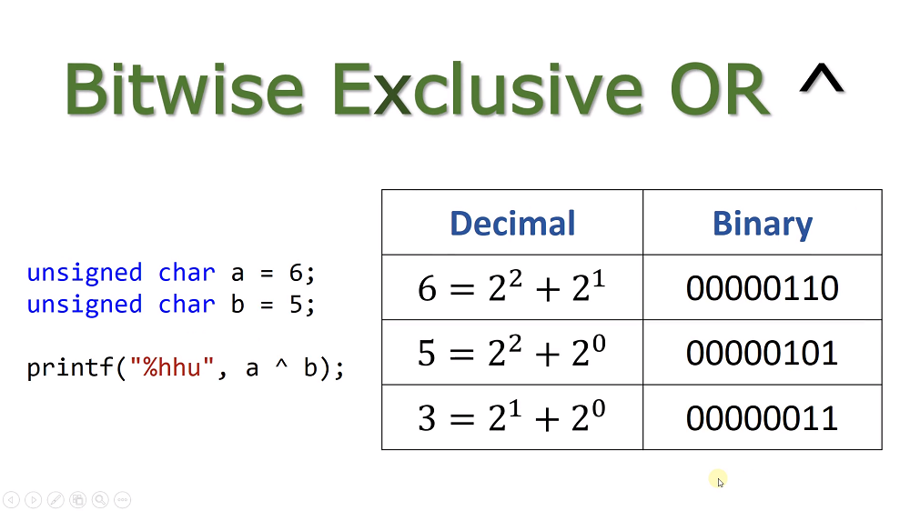
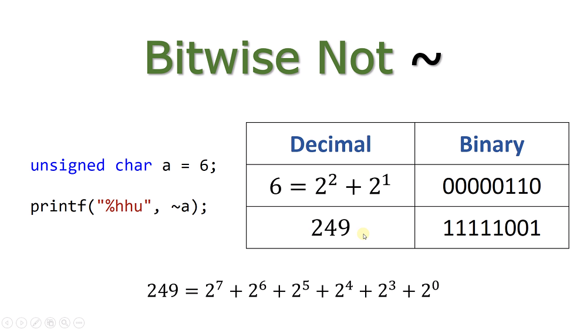

# 15.1 비트단위 논리 연산자 Bitwise Logical Operators

* 지금까지의 논리 연산자: 어떤 자료형의 변수나 상수에 적용되는 연산에 관한 것.

## 왜 필요한가?

* 비트를 쓰지 않으면 8바이트가 필요하다. 
    - '갖고 있다 or not'을 표현하기.
    - 메모리 낭비, 효율적이지 않음.

## Bitwise AND &

* 비트끼리 비교해서 결과를 만듦.
    * `1 & 1 = 1`, `1 & 0 = 0`, `0 & 1 = 0`, `0 & 0 = 0`.....
* 둘 모두 1이어야 1

## Bitwise OR |

* 둘 중 하나만 1이어도 1
    - `0 | 0 = 0`, `0 | 1 = 1`, `1 | 0 = 1`, `1 | 1 = 1`

## Bitwise Exclusive OR ^

* 둘 다 1이면 0
    - `0 ^ 0 = 0`, `0 ^ 1 = 1`, `1 ^ 0 = 1`, `1 ^ 1 = 0`

## Bitwise Not ~

* 단항 연산자
* 0은 1, 1은 0
  