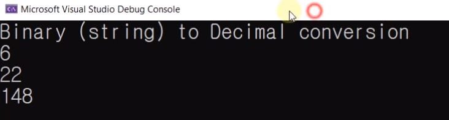

# 15.2 이진수를 십진수로 바꾸기 연습문제
## 예제

            #define _CRT_SECURE_NO_WARNINGS
            #include <stdio.h>
            #include <math.h>   // pow()
            #include <string.h> // strlen()
            #include <stdlib.h> // exit()

            unsigned char to_decimal(const char bi[]);

            int main()
            {
                printf("Binary (string) to Decimal conversion\n");

                printf("%d\n", to_decimal("00000110")); // 1 * (2 ^ 2) + 1 * (2 ^ 1) = 4 + 2 = 6
                printf("%d\n", to_decimal("00010110")); // 1 * (2 ^ 4) + 1 * (2 ^ 2) + 1 * (2 ^ 1) = 16 + 4 + 2 = 22

                // Note: ^ (caret) means power in math.
                // Hint: (int)pow(2, 3) == 8

                printf("%d\n", to_decimal("10010100"));

                return 0;
            } 

## prof.

            #define _CRT_SECURE_NO_WARNINGS
            #include <stdio.h>
            #include <math.h>
            #include <string.h>
            #include <stdlib.h>

            unsigned char to_decimal(const char bi[]);

            int main()
            {
                printf("Binary (string) to Decimal conversion\n");

                printf("%d\n", to_decimal("00000110")); // 1 * (2 ^ 2) + 1 * (2 ^ 1) = 4 + 2 = 6
                printf("%d\n", to_decimal("00010110")); // 1 * (2 ^ 4) + 1 * (2 ^ 2) + 1 * (2 ^ 1) = 16 + 4 + 2 = 22

                // Note: ^ (caret) means power in math.
                // Hint: (int)pow(2, 3) == 8

                printf("%d\n", to_decimal("10010100"));

                return 0;
            }

            unsigned char to_decimal(const char bi[])
            {
                const size_t bits = strlen(bi);
                unsigned char sum = 0;
                for (size_t i = 0; i < bits; ++i) // size_t
                {
                    if (bi[i] == '1')
                        sum += (int)pow(2, bits - 1 - i);
                    // sum += (unsigned char)pow((double)2, (double)(bits - 1 - i));
                    else if (bi[i] != '0') {
                        printf("Wrong character : %c", bi[i]);
                        exit(1);
                    }
                }

                return sum;
                // printf("Binary %s == Decimal %d\n", bi, sum);
            }
            
* `strlen(bi)` : 문자열로 입력받은 숫자가 몇 글자인지 확인하기 위한 함수.
* cf) `size_t` - x86: unsigned int, x64: unsigned long long
* 