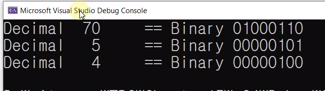
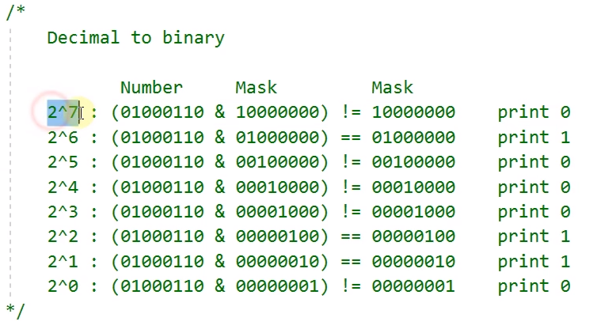

# 15.3 &를 이용해서 십진수를 이진수로 바꾸기 연습문제

## 예제

            #define _CRT_SECURE_NO_WARNINGS
            #include <stdio.h>
            #include <math.h>
            #include <string.h>
            #include <stdlib.h>
            #include <stdbool.h>

            unsigned char to_decimal(const char bi[]);
            void print_binary(const unsigned char num);

            int main()
            {
                unsigned char i = to_decimal("01000110");
                unsigned char mask = to_decimal("00000101");

                print_binary(i);
                print_binary(mask);
                print_binary(i & mask);

                return 0;
            }

            unsigned char to_decimal(const char bi[])
            {
                const size_t bits = strlen(bi);
                unsigned char sum = 0;
                for (size_t i = 0; i < bits; ++i) // size_t
                {
                    if (bi[i] == '1')
                        sum += (int)pow(2, bits - 1 - i);
                    else if (bi[i] != '0') {
                        printf("Wrong character : %c", bi[i]);
                        exit(1);
                    }
                }

                return sum;
            }

* hint
    - 변환하려는 숫자: 내부적으로 이미 2진수로 저장되어 있음.
    - mask 비교로 0, 1

## prof.

            #define _CRT_SECURE_NO_WARNINGS
            #include <stdio.h>
            #include <math.h>
            #include <string.h>
            #include <stdlib.h>
            #include <stdbool.h>

            unsigned char to_decimal(const char bi[]);
            void print_binary(const unsigned char num);

            int main()
            {
                unsigned char i = to_decimal("01000110");
                unsigned char mask = to_decimal("00000101");

                print_binary(i);
                print_binary(mask);
                print_binary(i & mask);

                return 0;
            }

            void print_binary(const unsigned char num)
            {
                printf("Decimal %3d \t== Binary ", num);

                const size_t bits = sizeof(num) * 8;
                for (size_t i = 0; i < bits; ++i)
                {
                    const unsigned char mask =
                        (unsigned char)pow((double)2, (double)(bits - 1 - i));
                    // unsigned char mask = pow(2, bits - 1 - i));
                    // pow 원형이 원래 double

                    if ((num & mask) == mask) // 0인지 1인지 알고 싶다면 mask.
                        printf("%d", 1);
                    else
                        printf("%d", 0);
                }
                // 엔디안

                // for (size_t i = bits - 1; i >= 0; --i) // size_t ERROR, unsigned이기 때문에. 거꾸로 갈 땐 사용x
                // for (int i = bits - 1; i >= 0; --i)
                // {
                // const unsigned char mask =
                //  (unsigned char)pow((double)2, (double)i);

                // if ((num & mask) == mask)
                //     printf("%d", 1);
                // if ((num & mask) == mask)
                //    printf("%d", 1);
                // else
                //    printf("%d", 0);
                // }
                printf("\n");
            }

            unsigned char to_decimal(const char bi[])
            {
                const size_t bits = strlen(bi);
                unsigned char sum = 0;
                for (size_t i = 0; i < bits; ++i) // size_t
                {
                    if (bi[i] == '1')
                        sum += (int)pow(2, bits - 1 - i);
                    else if (bi[i] != '0') {
                        printf("Wrong character : %c", bi[i]);
                        exit(1);
                    }
                }

                return sum;
            }