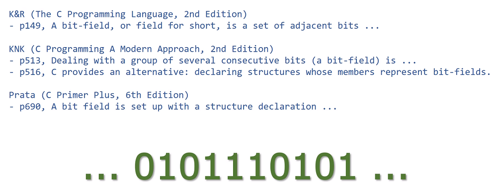
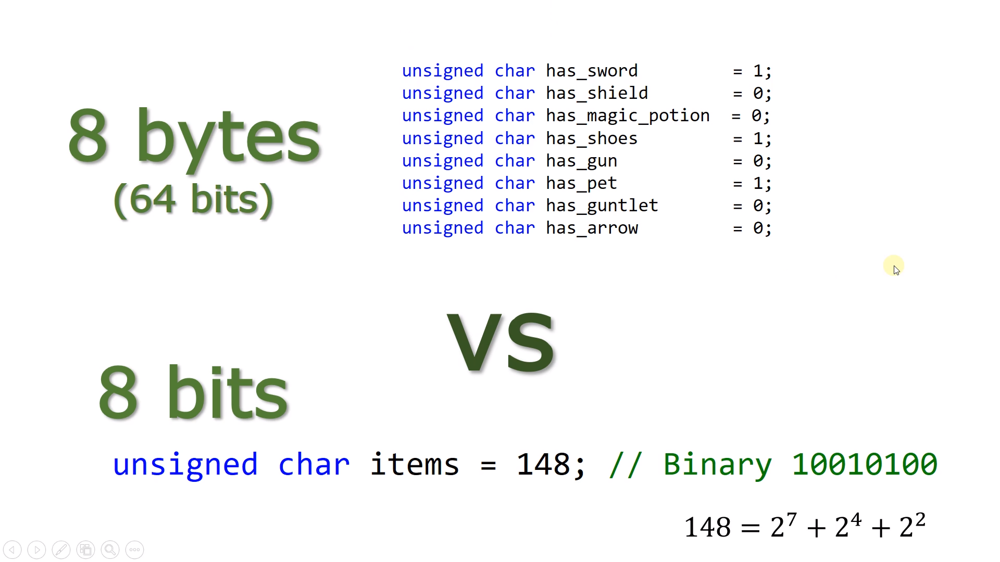
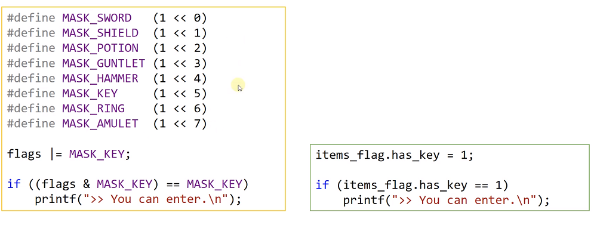

# 15.9 구조체 안의 비트 필드
* 필드: 장(場)
* 비트 필드: 비트가 연속적으로 나열되어 있는 형태

* 비트가 나열되어 있는 필드를 사용하기 위해 __구조체__ 를 사용.

* 비트: 같은 정보더라도 적은 메모리로 표현

## 비트 필드

* 각각의 멤버가 몇 비트를 사용할지 지정해줄 수 있음.

* 비트 필드, 비트 연산자 사용 => 혼용되어 사용됨.