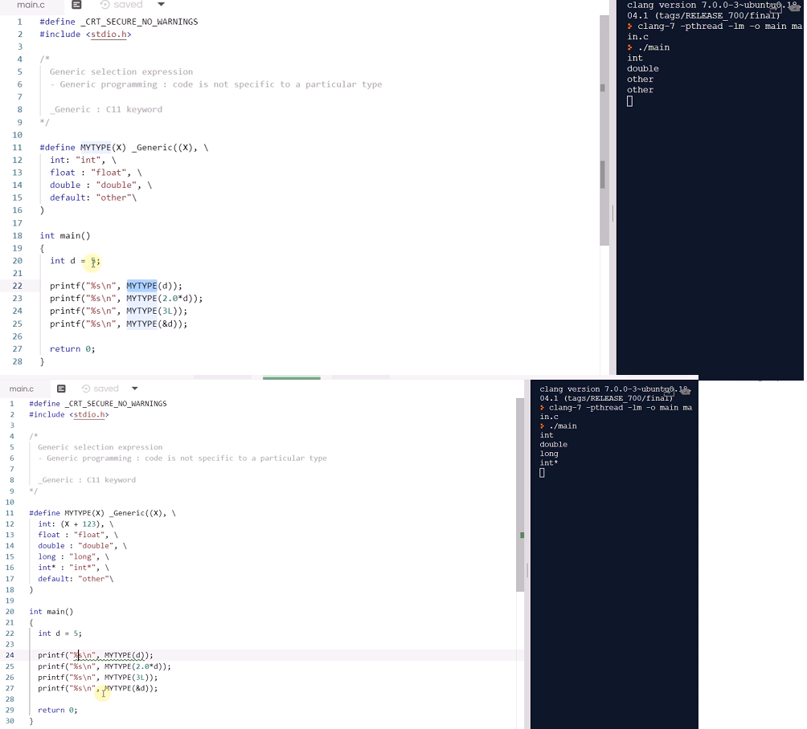

# 16.10 _Generic 표현식
* VS에선 제공 X
* generic programming
    - 특정 자료형에만 작동하는 것이 아니라, 여러 가지 자료형 각각에 모두 작동할 수 있는 코드를 만드는 일을 말함.
    - C++ template programming과 연관

            #define _CRT_SECURE_NO_WARNINGS
            #include <stdio.h>

            /*
                Generic selection expression
                - Generic programming: code is not specific to a particulartype

                Generic : C11 keyword
            */

            #define MYTYPE(X) _Generic((X), \
                int : "int", \
                float : "float", \
                double : "double", \
                default: "other"\
            )

            int main()
            {
                int d = 5;

                printf("%s\n", MYTYPE(d));
                printf("%s\n", MYTYPE(2.0*d));
                printf("%s\n", MYTYPE(3L));
                printf("%s\n", MYTYPE(&d));

                return 0;

            } 

* X엔 어떤 expression이 들어갈 수 있음.
* X의 자료형이 뭔지에 따라 매크로가 판단하는 값이 달라짐.
* 마치 switch case 사용과 비슷.

