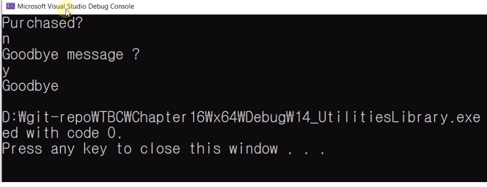
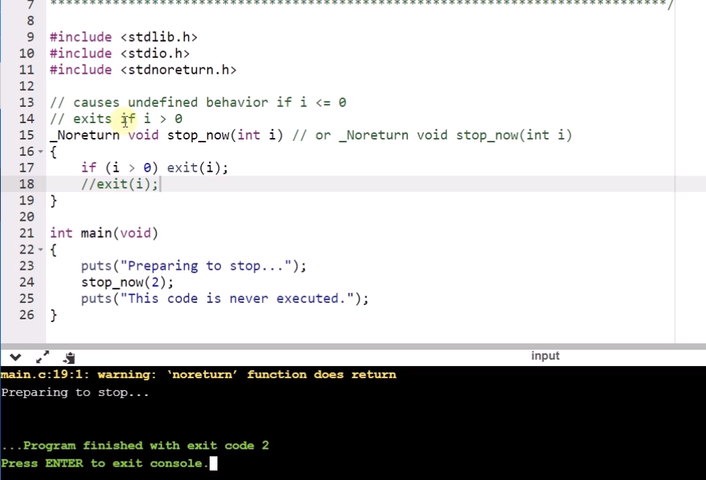
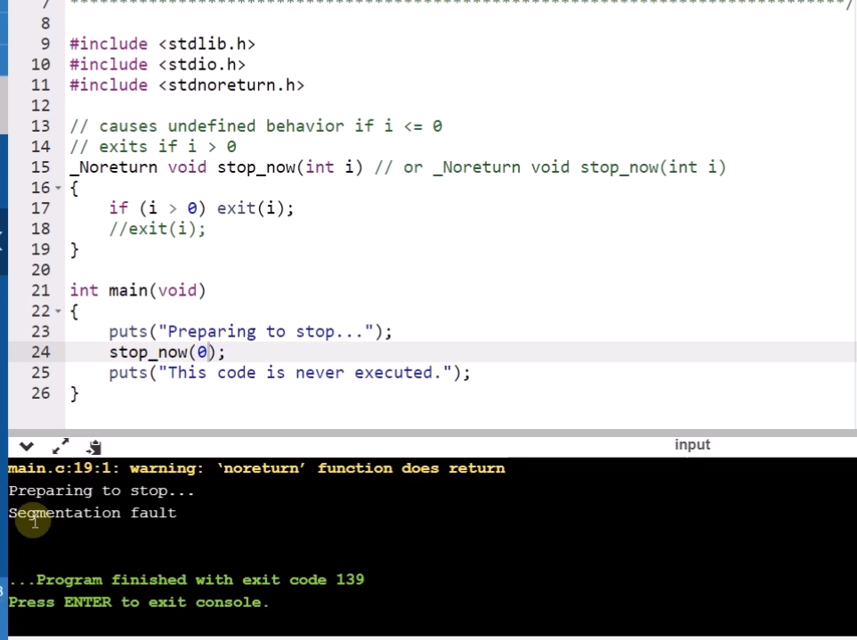

# 16.14 표준 유틸리티 라이브러리 Utilities

## 예제

            #define _CRT_SECURE_NO_WARNINGS
            #include <stdio.h>
            #include <stdlib.h>

            /*
                rand(), srand(), malloc(), free() ...
            */

            void goodbye(void)
            {
                printf("Goodbye\n");
            }

            void thankyou(void)
            {
                printf("Thankyou\n");
            }

            int main()
            {
                printf("Purchased?\n");
                if (getchar() == 'y')
                    atexit(thankyou);

                while (getchar() != '\n') {};

                printf("Goodbye message ?\n");
                if (getchar() == 'y')
                    atexit(goodbye);
                
                return 0;
            }

* `atexit()`: 프로그램이 종료될 때 특정 함수를 실행시킬 수 있음.
    - 내부적으로 함수 포인터의 목록을 갖고 있음.
    - 런타임에 추가됨.

### exit(0) 예시
* VS에선 X
* `_Noreturn`: 함수 앞에 붙는 지정자 중 하나.
    - 함수가 끝나고 어떤 프로그램이 실행되는 곳으로 돌아가지 않는다.
    - 여기서 끝난다.
    - `stdnoreturn.h` include.

* segmentation fault: 돌아가면 안 되는데 돌아갔기 때문에 출력.