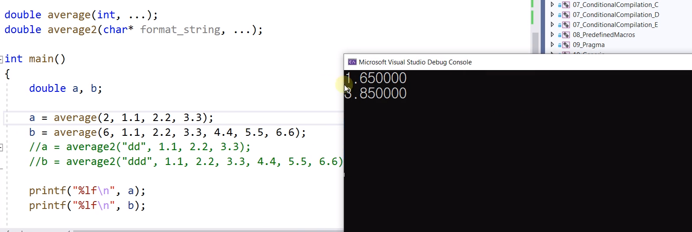

# 16.17 가변 인수 Variable Arguments
* 함수가 받아들이는 인수의 개수가 그때 그때 달라질 수 있다.
* `printf()` 함수는 가변 인수.

## Variable Arguments
  
            Variable Arguments
            - int printf(char const* const _Format,...);

1. Provide a function prototype using an ellipsis
    - 마지막에 말줄임표가 와야 함.

            void	vaf1(int n, ...); // OK
            int		vaf2(const char * s, int k, ...); // OK

    - 뒤에 다른 parameter가 있으면 안 됨.
            char	vaf3(char c1, ..., char c2); // Not ok, ellipsis should be the last.
    - ... 앞엔, 다른 parameter가 하나라도 있어야 함.
        - 그 parameter를 기준으로 말줄임표에 들어오는 여러 인수의 주소를 체크할 수 있기 때문.

            double	vaf4(...); // Not ok, no parameter.

2. Create a va_list type variable in the function definition
3. Use a macro to initialize the variable to an argument list.

## 예제

* 마지막에 말줄임표가 와야 함.
* 뒤에 다른 para 있으면 안 됨.

### 선언

            #define _CRT_SECURE_NO_WARNINGS
            #include <stdio.h>
            #include <string.h>
            #include <stdarg.h> // Variable arguments

            double average(int, ...);
            double average2(char* format_string, ...);

* parameter 입장에선 2개, 그러나 실제 사용은 여러 개.
* parameter가 달라질 수 있는 것을 ...로 표현.

### main
            int main()
            {
                double a, b;

                //a = average(2, 1.1, 2.2, 3.3);
                //b = average(6, 1.1, 2.2, 3.3, 4.4, 5.5, 6.6);
                a = average2("dd", 1.1, 2.2, 3.3);
                b = average2("ddd", 1.1, 2.2, 3.3, 4.4, 5.5, 6.6);

                printf("%lf%lf\n", a, b);

                return 0;
            }

* `average2`: 문자열의 글자수를 세는 방식.

### function

            double average(int num, ...)
            {
                va_list ap; // va_list 타입
                double sum = 0.0;
                int i;

                va_start(ap, num); 
                for (i = 0; i < num; i++)
                    sum += va_arg(ap, double); 
                va_end(ap);

                return sum / (double)num;
            }

* `va_start(ap, num);`
    - `va_start` macro에 2가지 전달.
        - ap하나랑
        - 2번째엔 ... 앞에 있는 마지막 parameter (`int num`)
    - 들어오는 타입이 어떤 타입인지 알아야 함

            double average2(char* format_string, ...)
            {
                int num = strlen(format_string);

                va_list ap;
                double sum = 0.0;
                int i;

                va_start(ap, format_string); 
                for (i = 0; i < num; i++)
                    sum += va_arg(ap, double);
                va_end(ap);

                return sum / (double)num;
            }
* `va_start(ap, format_string);`
    - format_string: 이 다음부터 variable argument가 들어온다를 알림.
