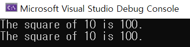
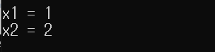

# 16.4 함수 같은 매크로
* 매크로는 선언된 값을 그대로 복사하는 것이기 때문에 의도와는 다르게 나올 가능성이 있음. 따라서 계산을 정확하게 하기 위해 괄호가 필요한 경우가 많음.
* 한편, 증가연산자 등은 함수든, 매크로든 parameter로 쓸 때 주의. (잘 안 씀)

## 예시 1: Strugling operator #
- `#x` 인자를 문자열로 바꾸고 넣는다. (converts macro parameters to string literals)
### 선언
            #define	SQUARE(X)	(X)*(X)
            #define PRINT_SQR1(x) printf("The square of %d is %d.\n", x, SQUARE(x))
            #define PRINT_SQR2(x) printf("The square of " #x " is %d.\n", SQUARE(x))

            #define XNAME(n)	x ## n
            #define PRT_XN(n)	printf("x" #n " = %d\n", x ## n);

### main

            int main()
            {
                PRINT_SQR1(10);
                PRINT_SQR2(10);

                return 0;
            }

### 결과

* `PRINT_SQR1(10)`: x에 10, SQUARE(10) => 10, 100이 계산되어 출력
* `PRINT_SQR2(10)`: #x = 10 (문자열), SQURARE(10)은 그대로.

## 예시 2: ## operator combines two tokens into a single token
* 2개의 토큰을 하나의 토큰으로 합침.
### 선언
            #define XNAME(n)	x ## n
            #define PRT_XN(n)	printf("x" #n " = %d\n", x ## n);

* x는 그냥 말 그대로 문자 x, `n`은 parameter.

### main

            int XNAME(1) = 1;	// int x1 = 1;
            int XNAME(2) = 2;	// int x2 = 2;

            PRT_XN(1);			// printf("x1 " = %d\n", x1);
            PRT_XN(2);			// printf("x2 " = %d\n", x2);

* `XNAME(1)`은, `x ## 1`, 즉 `x1`이 됨.
    - 이에 `int XNAME(1) = 1;`은, `int x1 = 1`
    - `PRT_XN(n)` 역시 마찬가지.
    - `PRT_XN(1)` == `printf("x" #1 " = %d\n", x ## 1);`
        - `printf("x1 = %d\n", x1);` 

### 결과

## Macro or Funciton?
* 매크로 이름에도 공백은 사용 불가 no space in the macro name
* 괄호 사용하기 Use parentheses
* 매크로 함수 이름은 대문자 Use capital letters for macro function names
* 시간 활용 ↑ Speed up?

### 예시

            #define MAX(X,Y)		((X) > (Y) ? (X) : (Y))
            #define MIN(X,Y)		((X) < (Y) ? (X) : (Y))
            #define ABS(X,Y)		((X) < 0 ? -(X):(X))

* 그러나 매크로는 디버깅이 어려움.