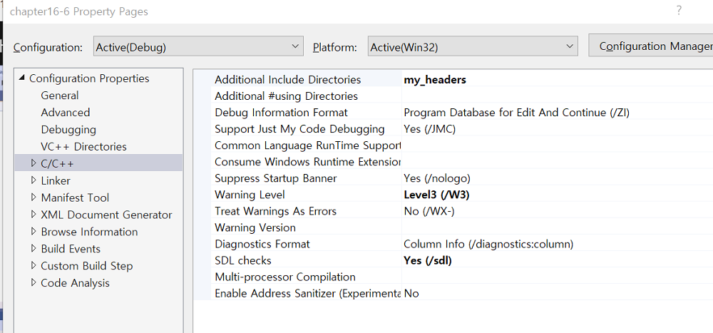
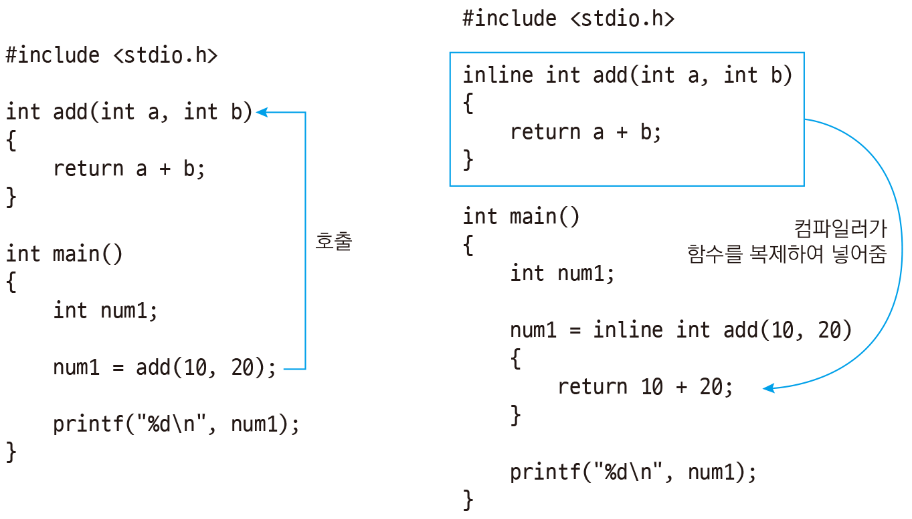

# 16.6 #include와 헤더 파일

* `<>`: 컴파일러가 어디에 있는지 이미 알고 있는 위치에 있는 헤더파일을 가져올 때. (표준 라이브러리)
* 상대 경로 지정하여 헤더 include 가능. (절대 경로는 안 씀)
* 프로젝트 속성 - C/C++ - Additional Include Directories 에서 추가도 가능.

* 추가 경로를 설정하면 `<>`로도 가능하나, 스스로가 만든 헤더는 `""`

* 헤더 파일: 공통이 되는 부분을 모아두는 역할
    - 이런 것조차 오픈소스 라이브러리에서 가져오는 편

## main.c

            #define _CRT_SECURE_NO_WARNINGS
            #include <stdio.h>
            #include "my_functions.h"
            #include "my_structures.h"
            #include "my_macros.h"	// path

            extern int status;

            int main()
            {

            #include "hello_world.h"
                
                printf("PI = %f\n", PI);
                
                printf("%p %d\n", &status, status);

                print_status();

                printf("%d\n", multiply(51, 2));

                printf("main()\n");
                printf("Static function address %p\n", multiply);
                printf("Static function address %p\n", &si);

                print_address();

                patient_info james = { "James Bone", 45 }, michael = {"Michael Jobs", 50};

                return 0;
            }

## 나머지 파일
### hello_world.c
* `hello_world.h` 내용: `printf("Hello world from a header file!\n");`
* `#include "hello_world.h"` test for `#include`가 완전히 복붙 확인.
    - 그러나 이런 식으로 코딩하는 일은 없음.

### my_functions.h
            #pragma once

            extern int status;

            static int si = 0; 

            extern int add(int a, int b); 

            static int multiply(int a, int b)
            {
                return a * b;
            } 

            // int subtract(int a, int b)
            inline int subtract(int a, int b)
            {
                return a - b;
            }

            void print_status();
            void print_address();
* `static int si = 0; `
    - `static`을 선언 => 파일 scope.
    - 그러나 `my_funcitons.h`를 `include` 하면, `include`한 곳에서도 사용 가능. 즉, 공통으로 사용 가능하다는 뜻.
* `extern int add(int a, int b);`
    - 함수는 기본적으로 셋팅이 `extern`임. 따라서 `extern` 키워드를 붙여주지 않아도 자동으로 `extern` 처리됨.
    - 함수는 헤더 파일엔 '정의' (프로토타입)만 모아두고, body 부분은 c파일에 분류함.
* `static int multiply(int a, int b)`
    - static 함수의 경우, body도 헤더 파일 내에 둘 수 있다.
* `inline int subtract (int a, int b)`
    - 인라인 함수 (C언어 코딩 도장)
        - 실행을 해보면 일반 함수와 다르지 않습니다. 하지만 다음과 같이 인라인 함수는 호출을 하지 않고 함수의 코드를 그 자리에서 그대로 실행합니다. 즉, 컴파일러는 함수를 사용하는 부분에 함수의 코드를 복제해서 넣어줍니다. 
        - 즉, 함수 호출 과정이 없으므로 속도가 좀 더 빠릅니다. 따라서 인라인 함수는 자주 호출되면서 속도가 중요한 부분에 주로 사용합니다. 단, 함수의 코드가 복제되므로 함수를 많이 사용하면 실행 파일의 크기가 커집니다.

- 출처: [C언어 코딩 도장](https://dojang.io/mod/page/view.php?id=748)

### my_structures.h

            #pragma once

            typedef struct {
                char name[100];
                int age;
            } patient_info;

### my_macros.h

            #pragma once

            #define MAX(X,Y)		((X) > (Y) ? (X) : (Y))
            #define MIN(X,Y)		((X) < (Y) ? (X) : (Y))
            #define ABS(X,Y)		((X) < 0 ? -(X):(X))

            #define GRAVITY		9.8
            #define PI			3.141592

## 기타
### #pragma once

* 자기 자신을 include => 헤더 가드.

* pragma 이전의 원래 방식
    * `#ifndef __MY_FUNCTIONS__`, if not defined, `#define __MY_FUNCTIONS__`.
        - 마지막: `endif`
        - 딱 한 번만 포함되도록 함.