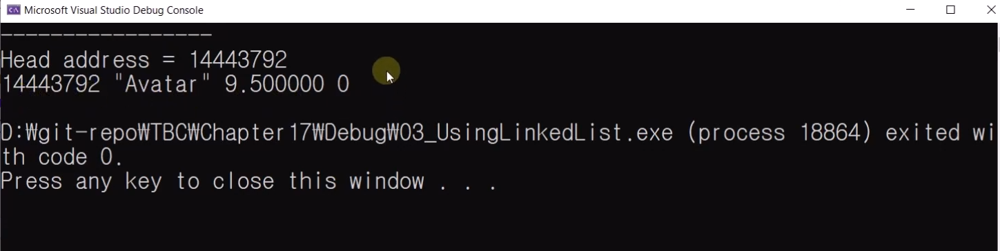
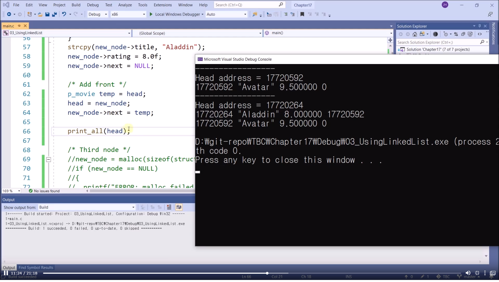
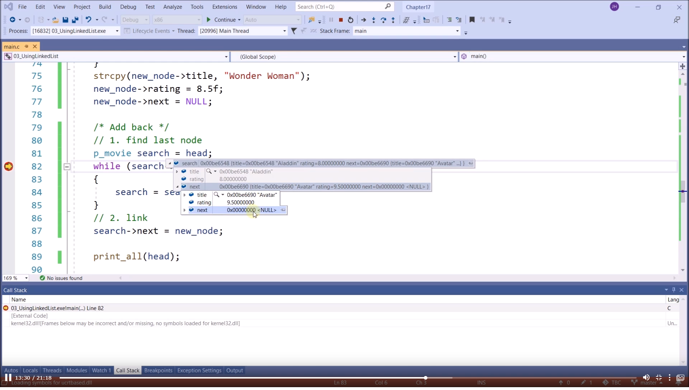
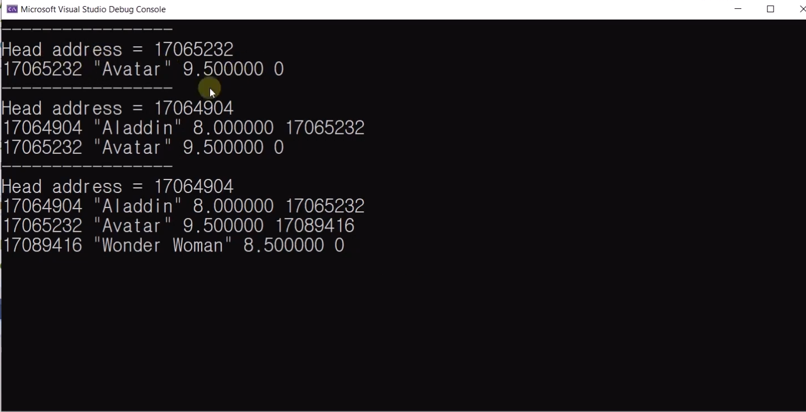
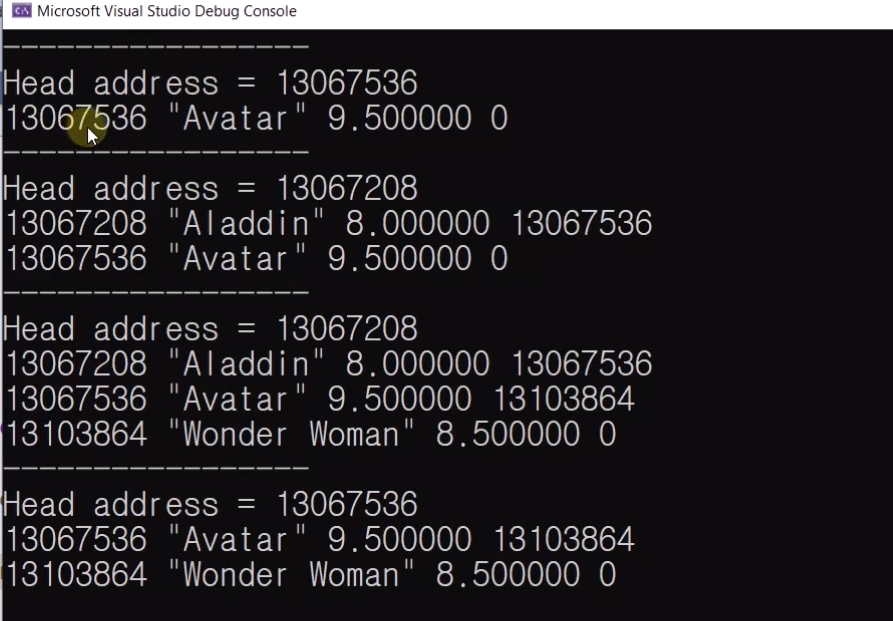

# 17.4 연결 리스트 Linked List 사용하기

## 코드 및 실행 Part
* [전체 코드](https://github.com/kkan9ma/following_C/blob/master/sources/chapter17/17.4)

### Section 0: 구조체 선언과 Linked-List
* 특징: `struct movie`에 `struct movie* next`가 생김
    - linked list를 위한 포인터
    - data item: title, rating
        - cf) data item만 따로 묶을 수도 있는데 이것은 '추상 자료형'과 관련

* typedef로 `struct movie*`를 `p_movie`로 사용함.

### Section 1: main 함수
#### NULL 포인터
* `p_movie head = NULL;`
    - 연결 리스트 자료는 메모리에 순차적으로 위치하는 것이 아님.
    - 따라서 자료를 찾기 위해선, 자료가 무언가 가리키는 상태가 되어야 함.
    - '무언가'는 맨 앞에 온다는 의미로 HEAD라 불림.
    - 또한 아직 아무 node도 없기에 NULL포인터로 초기화함.

#### part 1: 첫 아이템 생성
            p_movie new_node = malloc(sizeof(struct movie));
            if (new_node == NULL)	
            {
                printf("ERROR: malloc failed.");
                exit(1);
            } 
            strcpy(new_node->title, "Avatar");
            new_node->rating = 9.5f;
            new_node->next = NULL; 

            if (head == NULL)
                head = new_node; // First node 
            // else {} // insert or add back

            print_all(head); 

* `p_movie new_node = malloc(sizeof(struct movie));`
    - malloc으로 메모리 공간 할당
* if문: 할당 실패 여부 알려주는 조건문

            strcpy(new_node->title, "Avatar");
            new_node->rating = 9.5f;
            new_node->next = NULL; 
- 새로 만든 node(`new_node`)에 data를 대입하여 초기화.
- `new_node->next = NULL;`: __다음 가리킬 데이터가 무엇인지 알 수 없기에 NULL로 초기화.__

            if (head == NULL)
                head = new_node; // First node 
            // else {} // insert or add back
* head가 아직 __NULL__ 이기 때문에, 처음으로 만든 노드를 가리키도록 함.

##### 출력 결과

* next로 가리키는 데이터는 없음. (46행) next 포인터는 0

#### Part 2: second node
            new_node = malloc(sizeof(struct movie));
            if (new_node == NULL)
            {
                printf("ERROR: malloc failed.");
                exit(1);
            }
            strcpy(new_node->title, "Aladdin");
            new_node->rating = 8.0f;
            new_node->next = NULL;
* 새로운 node 생성하고 초기화.
##### Add front: 새로운 node를 기존 자료 앞에 더할 경우

            p_movie temp = head; 
            head = new_node; 
            new_node->next = temp;
* `temp`를 만들어 `head`를 담고, `new_node`가 `head`가 되도록 함.
    - `temp`에 담겨 있던 `head`(첫 번째 노드)의 주소는 `new_node`의 next로 붙임.

* 새롭게 추가된 `Aladdin` 데이터가 `Avatar`보다 앞에 있는 것을 확인할 수 있음.
    - head address가 변경됨. (17720592 -> 17720264)
    - `aladdin`의 next pointer: 처음 만들었던 avatar를 가리킴.
    - 두 번째 만든 걸 앞으로 끼워넣었음.

#### Part 3: Third node
            new_node = malloc(sizeof(struct movie));
            if (new_node == NULL)
            {
                printf("ERROR: malloc failed.");
                exit(1);
            }
            strcpy(new_node->title, "Wonder Woman");
            new_node->rating = 8.5f;
            new_node->next = NULL;
##### Add back: 새로운 node를 기존 자료 뒤에 붙일 경우
###### step 1: find last node
        	p_movie search = head;

* 어떤 새로운 것을 기존 자료 뒤에 붙이기 위해선, 기존 자료 중 맨 뒤의 것이 무엇인지 찾아야 한다.
    - 이를 위해선 기존 자료의 HEAD를 알아야 함.
    - Linked-list는 배열처럼 임의적으로 접근할 수 없고, 순차적으로만 접근 가능하기 때문.
* 구조체를 가리키는 포인터 search를 생성하고, 생성할 포인터가 head의 값을 넣도록 선언.

###### step 2: while

            while (search->next != NULL)
            {
                search = search->next;
            }
* while문으로 `search`에 마지막 노드의 next 포인터가 담기도록 함.
* while문은 HEAD부터 next 포인터를 가리키도록 되어 있으므로 `HEAD->next->next...`의 과정이 반복되다가, 더 이상 가리킬 것이 없게 되면, 즉, 기존 자료의 맨 뒤의 위치에 도달하게 되면 종료됨.

###### step 3: link
            search->next = new_node;

- 찾아낸 마지막 노드의 위치(`search`)에서 next가 `new_node`를 가리키게 함.

- Avatar의 원래 next는 null pointer였는데, 새로 만들고 확인해보니 원더우먼을 가리킴.

#### Part 4: Find and delete an item
* `Aladdin` 노드를 지우는 상황을 가정함.
* 연결 리스트는 각 노드가 다음 데이터로 연결되는 주소를 갖고 있다. 
    - 따라서 중간에 있는 노드를 지울 때 다음 노드로 연결되는 주소 정보를 저장해두지 않는다면, 지운 노드 이전의 노드에서 지운 노드 이후의 노드로 연결될 방법이 없다.
    - 따라서 지울 노드의 이전 노드가 가리키는 주소를 저장해두어야 한다.

            search = head;
            p_movie prev = NULL;

            int count = 0;
            while (search != NULL)
            {
                if (strcmp(search->title, "Aladdin") == 0) break;

                prev = search;			
                search = search->next;
                count++;
            }
##### Find
###### step 1: Declaration
* `Aladdin`을 지울 예정이기에, 이를 찾기 위해 search가 head를 가리키도록 함.
* 단, 주소를 저장해두어야 하기에 새롭게 구조체를 가리키는 `prev`를 선언함.
###### step 2: While
            if (strcmp(search->title, "Aladdin") == 0) break;
            prev = search;
* 반복문을 통해 `"Aladdin"`과 일치하는 노드를 찾고, `search`에 담음.
            prev = search;
* `prev`에 `search`를 이용하여 이전 노드의 포인터를 저장함.
            search = search->next;
* 다음 노드를 가리키도록 하기.
##### Delete
###### step 1: error check
            if (search == NULL)
            {
                printf("Wrong title\n");
                return;
            }
* 찾는 것이 존재하지 않는다면 지울 수 없다.

###### step 2: 조건문
            if (prev == NULL) 
                head = search->next; 
* 찾은 값을 담은 `prev`에 대하여 `prev == NULL`인 경우는, `prev`가 `head`일 때만 가능함.
* 이에 자신이 맨 앞 자료여서 갖고 있던 `head`를 다음 자료에게 넘겨주지 않고 삭제하면 자료를 찾을 수 없게 됨.
* 따라서 head를 다음 자료에게 넘겨줌.

            else
                prev->next = search->next;
        
        	free(search);
*  찾은 값을 담은 `prev`가 `head`가 아닌 경우엔, 중간 값을 빼는 상황과 같음.
    - `prev`엔 `search`의 이전 노드의 주소가 담겨 있음.
    - `search`엔 찾은 노드의 주소가 담겨 있음.
        - `search`는 `prev`를 가리키고 있음.
    - 이에 가운데에 있는 `search`를 빼준다면, `prev->next`를 `search->next`로 바꿔주고 빼야 데이터가 쭉 연결됨.

	        free(search);
* 찾은 데이터 `search`를 제거.

#### Part 5: 최종 결과

* 흐름 정리
    - 처음엔 아무 자료도 없으니 head 역할 자료를 하나 생성함.
    - Aladdin 생성. 
        - 뒤에 가리킬 자료가 없음. next: 0
        - Aladdin이 head 포인터를 가리킴(head)
    - Avatar 생성
        - Aladdin next가 없었으나(0) avatar가 들어오며 생김.
        - Avatar 주소 == Aladdin next
    - Wonder Woman 생성
        - Avatar next가 없었으나(0) Wonder Woman이 들어오며 생김.
        - Wonder Woman == Avatar next
        - Wonder Woman next는 없으니 0
    - Aladdin 삭제
        - Avatar 주소가 head가 됨.
    - 앞에 있던 게 NULL: head 역할이었구나. 
        - head 주소값이 바뀜.
        - Aladdin의 next값으로 head가 바뀜.
        - head가 Avatar의 주소를 갖게 되었음.
    - Wonder Woman의 next는 여전히 없으니 0