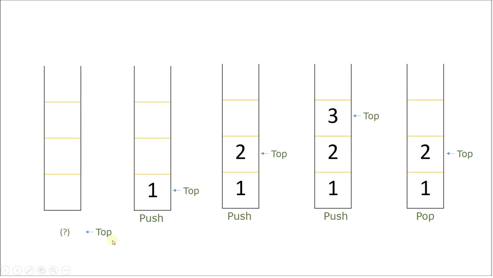
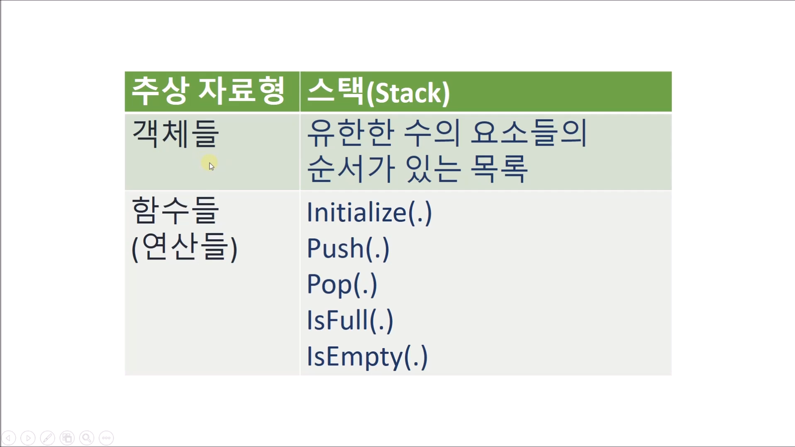

# 17.9 스택 자료구조

### 스택의 주된 특징
* 보통은 속도가 중요한 알고리즘을 구현할 때 사용.
    - 배열로 구현 ↑
* 배열에 저장되는 각각의 데이터 아이템들은 요소(element)라 불리는 경우가 많음.

* 가장 늦게 들어온 아이템이 가장 먼저 나가는 구조.
    - LIFO(Last-In-First-Out), FILO(First-In-Last-Out)
    
### 스택 - 추상 자료형

## 예제 코드 1
